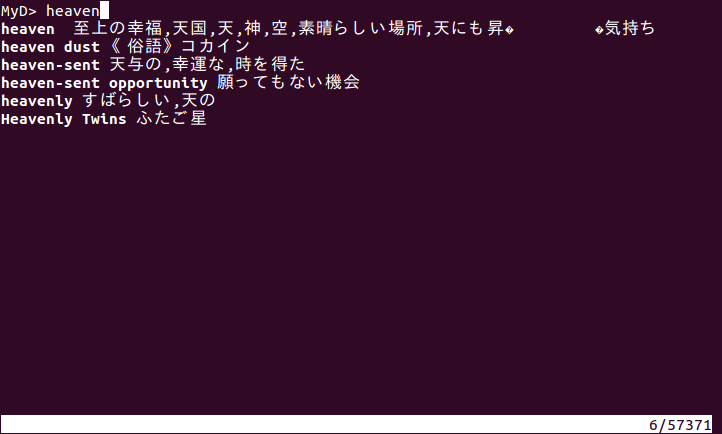

# MyD

MyD is very powerful and useful CUI base dictionaly tool.

FEATURES
 * support X Window Selection (you can input search word use double click on kterm or emacs or more.)
 * incremental search
 * High performance using Binary Search.
 * case-insensitive.
 * emacs key bind.

# myd-3.4-plus

myd-3.4-plus is a few extension of MyD.

  MyD's X Window Selection FEATURE is very very useful.
  But not in X Window environment that FEATURE is not work and still require X Window libraries.
  So, myd-3.4-plus provide configure option that disable X Window FEATURE.

  myd-3.4-plus provide '-1' command line option.
  execute "$ myd -1" that will random output a line from dictionary and exit.
  This option is useful for output dictionaly result every command line prompt.

  ~~~ sh
  (.zshrc)
  precmd() {
    PROMPT="[`myd -1`]$
  ->"
  }
  ~~~

FEATURES
 * provide --disable-x-window-selection option in configure script.
 * provide '-1' command line option.

## install

1. Check out myd-3.4-plus`.

    ~~~ sh
    $ git clone git://github.com/shinoburc/myd-3.4-plus
    ~~~

2. Configure

    ~~~ sh
    $ cd myd-3.4-plus
    $ ./configure
    or if you do not use X Window Selection
    $ ./configure --disable-x-window-selection
    ~~~

3. Make install

    ~~~ sh
    $ make
    $ sudo make install
    ~~~

4. Download and install GENE95(http://www.namazu.org/~tsuchiya/sdic/data/gene.html) dictionaly

    ~~~ sh
    $ wget http://www.namazu.org/~tsuchiya/sdic/data/gene95.tar.bz2
    $ tar jxf gene95.tar.bz2
    $ mkdir ~/.myd (or mkdir /usr/local/share/myd if you install system space.)
    $ nkf -w gene.txt > ~/.myd/dict.txt
    ~~~

## Getting Started

  ~~~ sh
  $ myd
  or
  $ myd -1
  ~~~
